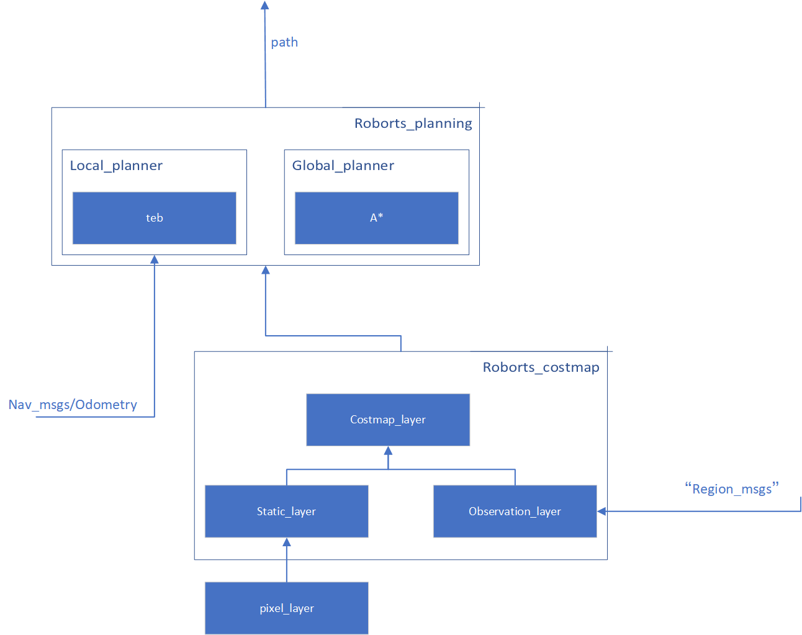
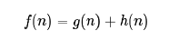
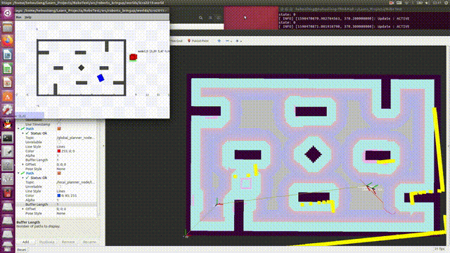
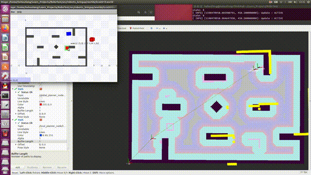

# 机器人导航与路径规划算法

```
src/
├── roborts_base					          #机器人基础功能包  
├── roborts_bringup					        #启动功能包，对其内部map/的地图做了更换，更改rviz/roborts.rviz的主题订阅  
├── roborts_camera					        #相机功能包  
├── roborts_common					        #错误信息、接口、算法等普适的文件  
├── roborts_costmap           		  #代价地图功能包，为路径规划器提供地图信息。  
├── roborts_decision                #决策功能包  
├── roborts_detection               #侦察敌方机器人等算法  
├── roborts_localization            #传感器和定位功能包  
├── roborts_msgs					          #消息定义文件  
├── roborts_planning				        #路径规划功能包，调整局部规划器为teb算法，采用LINE模型，并调节相关参数  
├── roborts_tracking				        #追踪、预测功能包  
├── pics		#README图片  
```  
##重点改进
**修改了roborts_costmap/obstacle_layer.cpp和roborts_costmap/obstacle_layer.h两个文件，加入设置惩罚区函数


## 依赖工具、软硬件环境

该部分基于C++语言，由roborts_costmap和roborts_planning两个功能包共同组成，全局路径规划利用A*算法，局部路径规划使用teb算法，实现高速运动规划、有效规避动态障碍物和惩罚区、有效通过狭窄通道等功能。

程序依赖工具如下：

* RoboRTS环境


##编译、安装方式

将该部分代码分别替换RoboRTS中对应文件，即为安装完成。执行catkin_make执行编译。


## 内容简述

本程序可利用A*算法进行全局路径规划，在静态图中实现每秒3次的规划频率，同时在代价地图功能包中，通过改变障碍物图层上像素单元的代价值的方法实现标记比赛中低频刷新的惩罚区。机器人在进行全局规划时会将其视作静态障碍物，达到规避目的。局部路径规划方面，使用teb算法……目前程序能实现以下功能：

- 在静态障碍物组成的地图中完成高速的运动规划（A*算法）

- 通过障碍物之间的狭缝（teb算法）

- 规避出现的动态障碍物（teb算法）

- 规避惩罚区域（A*算法）

  

## 软件架构层级图

  
  


##原理介绍与理论支持分析：

### A*算法：

* A*算法优先级计算公式如下 

* 原理图：

  

* f(n)是节点n的优先级。路径选取时，选取综合优先级最高的节点。g(n) 是节点n距离起点的代价。h(n)是A*算法的启发函数。

### teb算法（Timed-Elastic-Band）

* TEB 对全局规划生成的轨迹进行“弹性优化”，生成一系列带有时间信息的离散位姿，最终由这些离散位姿组成的时间最短、距离最短、远离障碍物的轨迹，同时限制速度与加速度使轨迹满足机器人的运动学方程。
* TEB生成的局部轨迹由一系列带有时间信息的离散位姿(pose)组成，g2o算法优化的目标即这些离散的位姿，使最终由
 
* 原理图
 
  
  

### 代价地图

* 代价地图底层由静态图层和障碍物图层构成，静态图层仅刷新一次，障碍物层则不断刷新。图上的每个点都对应一个代价值，代价值越高，该点的通过性越差，路径规划总是寻找代价值最低的路径。在障碍物层里将惩罚区所在的单元格代价值设为致命障碍物级别并实时刷新，即可实现规避惩罚区的功能。

* 原理图

  


### 测试步骤

* 将程序文件依次替换RoboRTS对应文件

* 在/robots_ws下打开终端，执行catkin编译

* 执行“source devel/setup.bash"

* 执行“roslaunch roborts_bringup roborts_stage.launch”（或其它类似语句）

* 执行“rosrun roborts_decision behavior_test_node”（或其它自己编写的节点）


### 测试结果





##代码规范
本程序代码规范遵循驼峰命名法。

